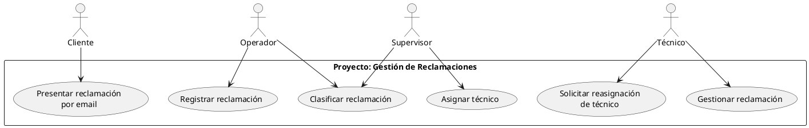
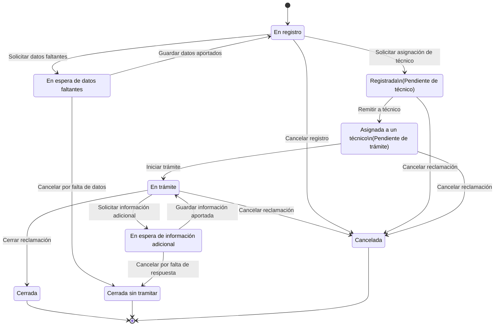
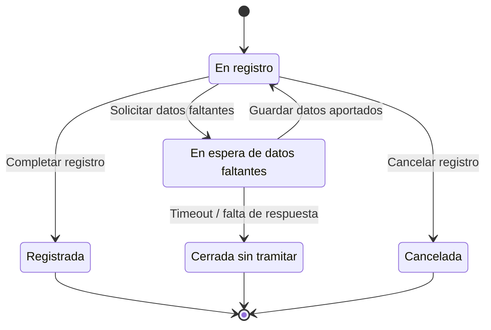
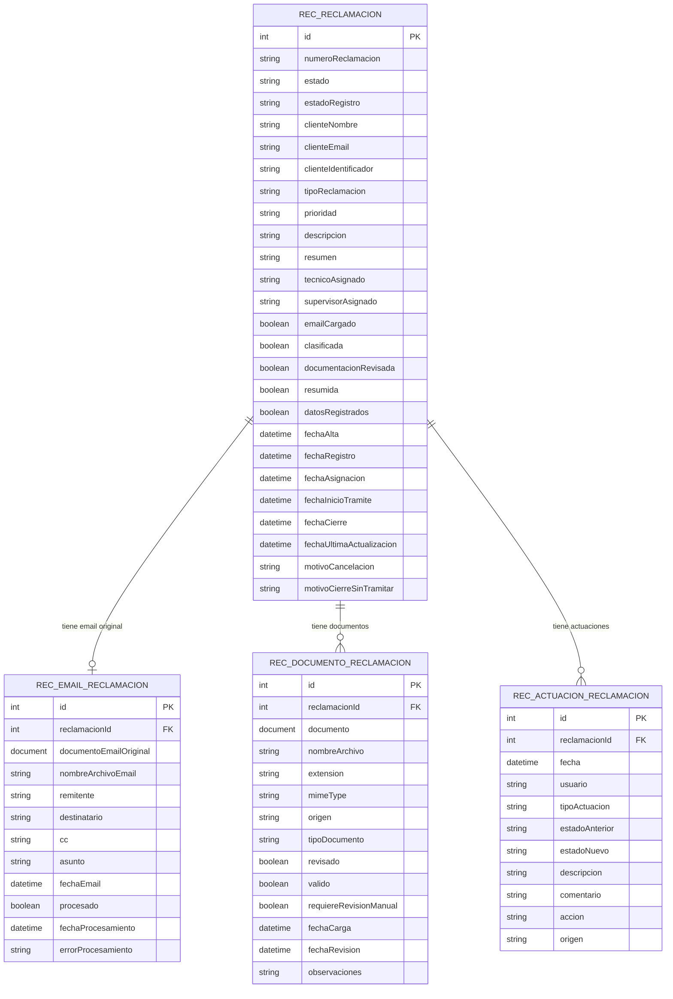

# Proyecto: Gestión de Reclamaciones:



# Máquina de estados de la reclamación:



# Estados:

## En registro

Tareas:
- Cargar email original de reclamación
- Registrar reclamación         \
- Clasificar reclamación        / Se hace en paralelo, no es necesario que se haga en orden. Misma UI.

Transiciones:
- Solicitar datos faltantes
- Solicitar asignación de técnico
- Cancelar registro

## En espera de datos faltantes

Tareas:
- Aportar datos faltantes

Transiciones:
- Guardar datos aportados
- Cerrar por falta de datos   (Timeout automático)

## Registrada

Tareas:
- Revisar reclamación registrada
- Revisar documentación asociada
- Validar clasificación
- Seleccionar técnico

Transiciones:
- Remitir a técnico
- Cancelar reclamación

## Asignada a un técnico

Tareas:
- Revisar reclamación registrada
- Revisar documentación asociada
- Revisar asignación

Transiciones:
- Iniciar trámite
- Solicitar reasignación de técnico
- Cancelar reclamación

## En trámite

Tareas:
- Revisar reclamación registrada
- Revisar documentación asociada
- Gestionar reclamación
- Añadir comentarios de trámite

Transiciones:
- Solicitar información adicional
- Cerrar reclamación
- Cancelar reclamación

## En espera de información adicional

Tareas:
- Revisar reclamación registrada
- Revisar documentación asociada
- Aportar información adicional

Transiciones:
- Guardar información aportada
- Cerrar por falta de respuesta   (Timeout automático)

## Estados finales

### Cerrada

Tareas:
- Consultar reclamación registrada
- Consultar documentación asociada
- Consultar resolución

### Cerrada sin tramitar

Tareas:
- Consultar reclamación registrada
- Consultar documentación asociada
- Consultar motivo de cierre

### Cancelada

Tareas:
- Consultar reclamación registrada
- Consultar documentación asociada
- Consultar motivo de cancelación

---

# Máquinas de estados del estado del registro

## Estado principal del registro:



## Estados de sus tareas:

- emailCargado: boolean
- clasificada: boolean
- documentacionRevisada: boolean
- resumida: boolean
- datosRegistrados: boolean

## Condición para completar el registro

La transición En registro → Registrada solo debería permitirse cuando se hayan completado las tareas mínimas necesarias.

- emailCargado = true
- clasificada = true
- documentacionRevisada = true
- datosRegistrados = true
- resumida = true

---
# Constantes:

## Máquina de estados del proceso principal:

### Estados de la reclamación:
```appian
CONS_ESTADO_RECLAMACION_EN_REGISTRO = "EN_REGISTRO"
CONS_ESTADO_RECLAMACION_EN_ESPERA_DATOS_FALTANTES = "EN_ESPERA_DATOS_FALTANTES"
CONS_ESTADO_RECLAMACION_REGISTRADA = "REGISTRADA"
CONS_ESTADO_RECLAMACION_ASIGNADA_TECNICO = "ASIGNADA_TECNICO"
CONS_ESTADO_RECLAMACION_EN_TRAMITE = "EN_TRAMITE"
CONS_ESTADO_RECLAMACION_EN_ESPERA_INFORMACION_ADICIONAL = "EN_ESPERA_INFORMACION_ADICIONAL"
CONS_ESTADO_RECLAMACION_CERRADA = "CERRADA"
CONS_ESTADO_RECLAMACION_CERRADA_SIN_TRAMITAR = "CERRADA_SIN_TRAMITAR"
CONS_ESTADO_RECLAMACION_CANCELADA = "CANCELADA"
```

### Transiciones:
```appian
CONS_ACCION_SOLICITAR_DATOS_FALTANTES = "SOLICITAR_DATOS_FALTANTES"
CONS_ACCION_GUARDAR_DATOS_APORTADOS = "GUARDAR_DATOS_APORTADOS"
CONS_ACCION_COMPLETAR_REGISTRO = "COMPLETAR_REGISTRO"
CONS_ACCION_CANCELAR_REGISTRO = "CANCELAR_REGISTRO"
CONS_ACCION_CERRAR_SIN_TRAMITAR_POR_FALTA_DATOS = "CERRAR_SIN_TRAMITAR_POR_FALTA_DATOS"
CONS_ACCION_REMITIR_A_TECNICO = "REMITIR_A_TECNICO"
CONS_ACCION_INICIAR_TRAMITE = "INICIAR_TRAMITE"
CONS_ACCION_SOLICITAR_INFORMACION_ADICIONAL = "SOLICITAR_INFORMACION_ADICIONAL"
CONS_ACCION_GUARDAR_INFORMACION_APORTADA = "GUARDAR_INFORMACION_APORTADA"
CONS_ACCION_CERRAR_RECLAMACION = "CERRAR_RECLAMACION"
CONS_ACCION_CANCELAR_RECLAMACION = "CANCELAR_RECLAMACION"
CONS_ACCION_CERRAR_SIN_TRAMITAR_POR_FALTA_RESPUESTA = "CERRAR_SIN_TRAMITAR_POR_FALTA_RESPUESTA"
```

# Expression Rules:

## Control de máquina de estados del proceso de reclamación

---

## 1. `ER_TransicionesReclamacion`

**Inputs:** ninguno
**Devuelve:** lista de mapas con `estadoOrigen`, `accion`, `estadoDestino`

```text
{
  a!map(
    estadoOrigen: cons!CONS_ESTADO_RECLAMACION_EN_REGISTRO,
    accion: cons!CONS_ACCION_SOLICITAR_DATOS_FALTANTES,
    estadoDestino: cons!CONS_ESTADO_RECLAMACION_EN_ESPERA_DATOS_FALTANTES
  ),
  a!map(
    estadoOrigen: cons!CONS_ESTADO_RECLAMACION_EN_ESPERA_DATOS_FALTANTES,
    accion: cons!CONS_ACCION_GUARDAR_DATOS_APORTADOS,
    estadoDestino: cons!CONS_ESTADO_RECLAMACION_EN_REGISTRO
  ),
  a!map(
    estadoOrigen: cons!CONS_ESTADO_RECLAMACION_EN_REGISTRO,
    accion: cons!CONS_ACCION_COMPLETAR_REGISTRO,
    estadoDestino: cons!CONS_ESTADO_RECLAMACION_REGISTRADA
  ),
  a!map(
    estadoOrigen: cons!CONS_ESTADO_RECLAMACION_EN_REGISTRO,
    accion: cons!CONS_ACCION_CANCELAR_REGISTRO,
    estadoDestino: cons!CONS_ESTADO_RECLAMACION_CANCELADA
  ),
  a!map(
    estadoOrigen: cons!CONS_ESTADO_RECLAMACION_EN_ESPERA_DATOS_FALTANTES,
    accion: cons!CONS_ACCION_CERRAR_SIN_TRAMITAR_POR_FALTA_DATOS,
    estadoDestino: cons!CONS_ESTADO_RECLAMACION_CERRADA_SIN_TRAMITAR
  ),
  a!map(
    estadoOrigen: cons!CONS_ESTADO_RECLAMACION_REGISTRADA,
    accion: cons!CONS_ACCION_REMITIR_A_TECNICO,
    estadoDestino: cons!CONS_ESTADO_RECLAMACION_ASIGNADA_TECNICO
  ),
  a!map(
    estadoOrigen: cons!CONS_ESTADO_RECLAMACION_REGISTRADA,
    accion: cons!CONS_ACCION_CANCELAR_RECLAMACION,
    estadoDestino: cons!CONS_ESTADO_RECLAMACION_CANCELADA
  ),
  a!map(
    estadoOrigen: cons!CONS_ESTADO_RECLAMACION_ASIGNADA_TECNICO,
    accion: cons!CONS_ACCION_INICIAR_TRAMITE,
    estadoDestino: cons!CONS_ESTADO_RECLAMACION_EN_TRAMITE
  ),
  a!map(
    estadoOrigen: cons!CONS_ESTADO_RECLAMACION_ASIGNADA_TECNICO,
    accion: cons!CONS_ACCION_CANCELAR_RECLAMACION,
    estadoDestino: cons!CONS_ESTADO_RECLAMACION_CANCELADA
  ),
  a!map(
    estadoOrigen: cons!CONS_ESTADO_RECLAMACION_EN_TRAMITE,
    accion: cons!CONS_ACCION_SOLICITAR_INFORMACION_ADICIONAL,
    estadoDestino: cons!CONS_ESTADO_RECLAMACION_EN_ESPERA_INFORMACION_ADICIONAL
  ),
  a!map(
    estadoOrigen: cons!CONS_ESTADO_RECLAMACION_EN_ESPERA_INFORMACION_ADICIONAL,
    accion: cons!CONS_ACCION_GUARDAR_INFORMACION_APORTADA,
    estadoDestino: cons!CONS_ESTADO_RECLAMACION_EN_TRAMITE
  ),
  a!map(
    estadoOrigen: cons!CONS_ESTADO_RECLAMACION_EN_TRAMITE,
    accion: cons!CONS_ACCION_CERRAR_RECLAMACION,
    estadoDestino: cons!CONS_ESTADO_RECLAMACION_CERRADA
  ),
  a!map(
    estadoOrigen: cons!CONS_ESTADO_RECLAMACION_EN_TRAMITE,
    accion: cons!CONS_ACCION_CANCELAR_RECLAMACION,
    estadoDestino: cons!CONS_ESTADO_RECLAMACION_CANCELADA
  ),
  a!map(
    estadoOrigen: cons!CONS_ESTADO_RECLAMACION_EN_ESPERA_INFORMACION_ADICIONAL,
    accion: cons!CONS_ACCION_CERRAR_SIN_TRAMITAR_POR_FALTA_RESPUESTA,
    estadoDestino: cons!CONS_ESTADO_RECLAMACION_CERRADA_SIN_TRAMITAR
  )
}
```

---

## 2. `ER_ObtenerTransicionReclamacion`

**Inputs:**

```text
ri!reclamacion
ri!accion
```

**Devuelve:** transición encontrada o `null`.

```text
a!localVariables(
  local!estadoActual: ri!reclamacion.estado,
  local!transiciones: rule!ER_TransicionesReclamacion(),

  local!coincidencias: reject(
    fn!isnull,
    a!forEach(
      items: local!transiciones,
      expression: if(
        and(
          fv!item.estadoOrigen = local!estadoActual,
          fv!item.accion = ri!accion
        ),
        fv!item,
        null
      )
    )
  ),

  index(
    local!coincidencias,
    1,
    null
  )
)
```

---

## 3. `ER_PuedeTransicionarLaReclamacion`

**Inputs:**

```text
ri!reclamacion
ri!accion
```

**Devuelve:** `true` / `false`.

```text
not(
  isnull(
    rule!ER_ObtenerTransicionReclamacion(
      reclamacion: ri!reclamacion,
      accion: ri!accion
    )
  )
)
```

Esta es la que usas para mostrar/ocultar botones en interfaces.

---

## 4. `ER_ObtenerSiguienteEstadoLaReclamacion`

**Inputs:**

```text
ri!reclamacion
ri!accion
```

**Devuelve:** estado destino o `null`.

```text
a!localVariables(
  local!transicion: rule!ER_ObtenerTransicionReclamacion(
    reclamacion: ri!reclamacion,
    accion: ri!accion
  ),

  index(
    local!transicion,
    "estadoDestino",
    null
  )
)
```

---

## 5. `ER_EsEstadoFinalReclamacion`

**Inputs:**

```text
ri!estado
```

**Devuelve:** `true` / `false`.

```text
contains(
  {
    cons!CONS_ESTADO_RECLAMACION_CERRADA,
    cons!CONS_ESTADO_RECLAMACION_CERRADA_SIN_TRAMITAR,
    cons!CONS_ESTADO_RECLAMACION_CANCELADA
  },
  ri!estado
)
```

---

## 6. `ER_TransicionarLaReclamacion`

**Inputs:**

```text
ri!reclamacion
ri!accion
```

**Devuelve:** reclamación actualizada o `null`.

Actualiza:

* `estado`
* `fechaUltimaActualizacion`
* `fechaRegistro`
* `fechaAsignacion`
* `fechaInicioTramite`
* `fechaCierre`

```text
a!localVariables(
  local!nuevoEstado: rule!ER_ObtenerSiguienteEstadoLaReclamacion(
    reclamacion: ri!reclamacion,
    accion: ri!accion
  ),

  if(
    isnull(local!nuevoEstado),
    null,
    a!update(
      data: ri!reclamacion,
      index: {
        "estado",
        "fechaUltimaActualizacion",
        "fechaRegistro",
        "fechaAsignacion",
        "fechaInicioTramite",
        "fechaCierre"
      },
      value: {
        local!nuevoEstado,
        now(),

        if(
          and(
            local!nuevoEstado = cons!CONS_ESTADO_RECLAMACION_REGISTRADA,
            isnull(ri!reclamacion.fechaRegistro)
          ),
          now(),
          ri!reclamacion.fechaRegistro
        ),

        if(
          and(
            local!nuevoEstado = cons!CONS_ESTADO_RECLAMACION_ASIGNADA_TECNICO,
            isnull(ri!reclamacion.fechaAsignacion)
          ),
          now(),
          ri!reclamacion.fechaAsignacion
        ),

        if(
          and(
            local!nuevoEstado = cons!CONS_ESTADO_RECLAMACION_EN_TRAMITE,
            isnull(ri!reclamacion.fechaInicioTramite)
          ),
          now(),
          ri!reclamacion.fechaInicioTramite
        ),

        if(
          and(
            rule!ER_EsEstadoFinalReclamacion(
              estado: local!nuevoEstado
            ),
            isnull(ri!reclamacion.fechaCierre)
          ),
          now(),
          ri!reclamacion.fechaCierre
        )
      }
    )
  )
)
```

---

## Uso correcto en el Process Model

El patrón sería:

```text
1. Recargar la reclamación actual desde REC_Reclamacion usando el id.
2. Guardarla en pv!reclamacionActual.
3. Ejecutar ER_TransicionarLaReclamacion.
4. Si devuelve null, ir a ruta de error.
5. Si devuelve una reclamación, hacer Write Records.
```

Ejemplo conceptual:

```text
pv!reclamacionActualizada = rule!ER_TransicionarLaReclamacion(
  reclamacion: pv!reclamacionActual,
  accion: pv!accion
)
```

Gateway después:

```text
isnull(pv!reclamacionActualizada)
```

Si `true`:

```text
Transición inválida / conflicto / error controlado
```

Si `false`:

```text
Write Records con pv!reclamacionActualizada
```

---

## Uso en interfaces

Para mostrar botón **Remitir a técnico**:

```text
rule!ER_PuedeTransicionarLaReclamacion(
  reclamacion: ri!reclamacion,
  accion: cons!CONS_ACCION_REMITIR_A_TECNICO
)
```

Para mostrar botón **Cerrar reclamación**:

```text
rule!ER_PuedeTransicionarLaReclamacion(
  reclamacion: ri!reclamacion,
  accion: cons!CONS_ACCION_CERRAR_RECLAMACION
)
```

---

# Entidades / Registros:

````markdown
# Records / entidades

## REC_Reclamacion

Entidad principal del expediente.

Campos:

```text
id
numeroReclamacion
estado
estadoRegistro

clienteNombre
clienteEmail
clienteIdentificador

tipoReclamacion
prioridad
descripcion
resumen

tecnicoAsignado
supervisorAsignado

emailCargado
clasificada
documentacionRevisada
resumida
datosRegistrados

fechaAlta
fechaRegistro
fechaAsignacion
fechaInicioTramite
fechaCierre
fechaUltimaActualizacion

motivoCancelacion
motivoCierreSinTramitar
````

---

## REC_EmailReclamacion

Email original asociado a la reclamación.

Campos:

```text
id
reclamacionId

documentoEmailOriginal
nombreArchivoEmail

remitente
destinatario
cc
asunto
fechaEmail

procesado
fechaProcesamiento
errorProcesamiento
```

---

## REC_DocumentoReclamacion

Documentos asociados a la reclamación.

Campos:

```text
id
reclamacionId

documento
nombreArchivo
extension
mimeType

origen
tipoDocumento

revisado
valido
requiereRevisionManual

fechaCarga
fechaRevision

observaciones
```

Valores posibles de `origen`:

```text
ADJUNTO_EMAIL
APORTADO_CLIENTE
SUBIDO_OPERADOR
GENERADO_INTERNO
```

---

## REC_ActuacionReclamacion

Historial de actuaciones sobre la reclamación.

Campos:

```text
id
reclamacionId

fecha
usuario
tipoActuacion

estadoAnterior
estadoNuevo

descripcion
comentario

accion
origen
```

Valores posibles de `origen`:

```text
USUARIO
SISTEMA
PROCESO
TIMEOUT
```

---

# Diagrama Entidad/Relación




Cardinalidades:

```text
REC_Reclamacion 1 ── 0..1 REC_EmailReclamacion
REC_Reclamacion 1 ── 0..N REC_DocumentoReclamacion
REC_Reclamacion 1 ── 0..N REC_ActuacionReclamacion
```
